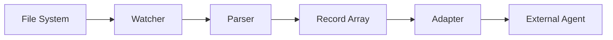

# Architecture Overview

relay-gent uses a Domain-Driven Design (DDD) architecture with strict layer separation.

## DDD Layers

```
src/
  domain/           # Core business logic - zero external dependencies
    record/         # Record schemas + identity computation
    parser/         # Parser interface + registry
    adapter/        # Adapter interface
    config/         # Configuration schemas
    errors/         # Custom error types
  application/      # Orchestration (CLI, watch loop) - depends on domain
  infrastructure/   # External I/O (file watching, HTTP, shell) - depends on domain + application
  parsers/          # Concrete parser implementations + barrel registration
```

**Layer rules:**
- **Domain** has no dependencies on application, infrastructure, or parsers. It defines interfaces, schemas, and pure business logic.
- **Application** orchestrates domain objects but does no I/O itself.
- **Infrastructure** handles all external interactions (file system, network, shell).
- **Parsers** are concrete implementations that register into the domain's parser registry.

## Data Flow



1. **Watcher** monitors files for changes (infrastructure layer)
2. **Parser** transforms raw file content into typed `Record[]` (domain interface, concrete implementations in `parsers/`)
3. **Adapter** delivers the batch to an external system (domain interface, concrete implementations TBD)

## Plugin System

Two extension points, both defined as interfaces in the domain layer:

- **Parsers** (input): Transform raw content into `Record[]`. Registered via `createParserRegistry()`.
- **Adapters** (output): Deliver `Record[]` to external systems. Defined by the `Adapter` interface.

See [Plugin System](plugin-system.md) for details.

## Schema-First Design

All data models are defined as Zod schemas first, with TypeScript types inferred from them:

```ts
const JsonLinesRecordSchema = BaseRecordSchema.extend({
  type: z.literal("json-lines"),
  message: z.string(),
  timestamp: z.string().optional(),
  level: z.string().optional(),
}).passthrough();

type Record = z.infer<typeof RecordSchema>;
```

This ensures runtime validation matches compile-time types exactly.

## Key Design Decisions

| Decision | Rationale |
|----------|-----------|
| Factory pattern for registries | Each `createParserRegistry()` call returns an independent instance with no shared state |
| Map-based lookup | O(1) parser retrieval by name |
| Discriminated unions on `type`/`adapter` | Type-safe narrowing with exhaustive checks |
| `.passthrough()` on json-lines | Preserves unknown fields for extensibility |
| Barrel re-exports (`index.ts`) | Clean public API surface; domain layer decoupled from implementations |
| Stub in domain, real impl via barrel | Domain ships a no-op parser; concrete implementations overwrite it at registration time |

## Error Handling

Two domain-specific error types:

- `SchemaValidationError` - wraps Zod validation failures with schema name, issues array, and raw input
- `IdentityComputeError` - raised when record identity computation fails (should never happen with valid records)

See [Record System](record-system.md) and [Plugin System](plugin-system.md) for implementation details.
